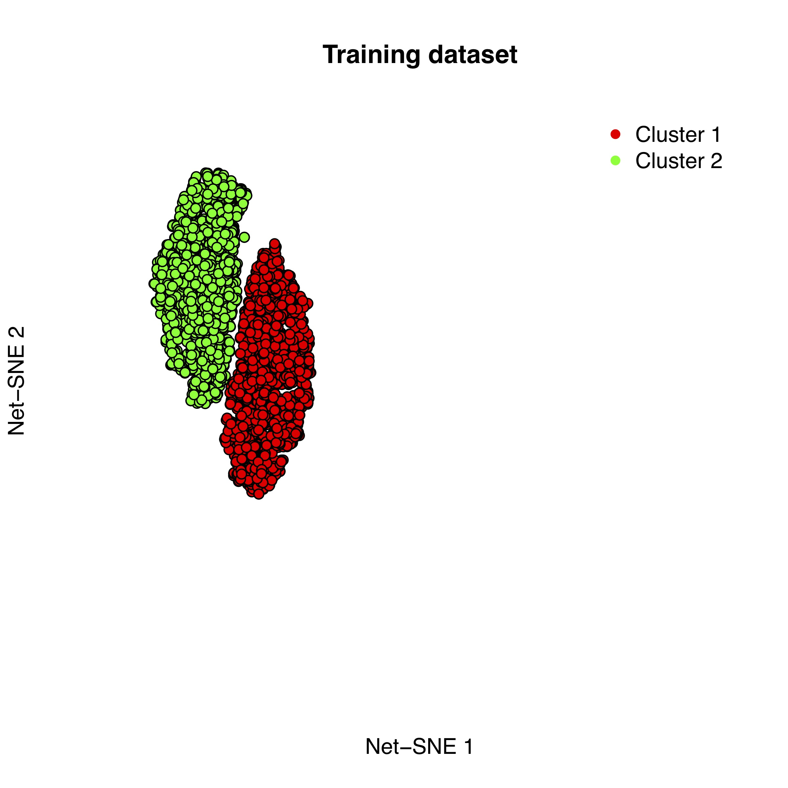

# rNetSNE
R wrapper for the net-SNE algorithm from Cho et al. (Cell System 2018).


### Installation

To work this package require the installation of net-SNE C code as described in https://github.com/hhcho/netsne

Once it is done you can install the latest version of the package from the github repository :

``` r
if(!require(devtools)){
  install.packages("devtools") # If not already installed
}
devtools::install_github("schwikowskilab/rNetSNE")
```

### General example

To check that net-SNE works you can first try it on a synthetic dataset.
Let's first load the rNetSNE and the MASS package.

``` r
library(rNetSNE)

if(!require(MASS)){
  install.packages("MASS") # You should have it installed anyway...
}
library(MASS)
```
We can then create two datasets : one training dataset with two multivariate Gaussian clouds, and a test set containing points from the two first clouds plus from a third one.

``` r
m1 = rbind(mvrnorm(n = 2000,mu = c(0,0,0,0,0),Sigma = diag(x = c(1,1,1,1,1))),
           mvrnorm(n = 2000,mu = c(3,3,3,3,3),Sigma = diag(x = c(1,1,1,1,1))))
labels_1=c(rep(1,2000),rep(2,2000))
m2 = rbind(mvrnorm(n = 500,mu = c(0,0,0,0,0),Sigma = diag(x = c(1,1,1,1,1))),
           mvrnorm(n = 500,mu = c(3,3,3,3,3),Sigma = diag(x = c(1,1,1,1,1))),
           mvrnorm(n = 500,mu = c(-20,-20,-20,-20,-20),Sigma = diag(x = c(1,1,1,1,1))))
labels_2=c(rep(1,500),rep(2,500),rep(3,500))
```

We now have to provide the path to the original net-SNE implementation but also provides the name and location of the output directory. Remember that the output directory will be created and should not be an already existing directory.

``` r
path.netSNE.dir = "/opt/ohpc/pub/libs/net-SNE/20180419/bin/" ### Location of the net-SNE directory 
path.output.dir = "Outputs"  ## Name and path of the output directory
```

In our case will perform  bhTSNE (classical T-SNE), training of net-SNE and projection of new points in a single shot using the function R_netSNE. All parameters are specified here but default parameters (according to the original paper) are however defined.

``` r
Result=R_netSNE(to.run = c("Compute.sim", "BhtSNE","NetSNE.train","NetSNE.project"), path.netSNE.dir = path.netSNE.dir,
                out.dims = 2, max.iter = 1e3L, perp = 30L, theta.BhtSNE = 0.5, theta.NetSNE = 0.5,
                mom.init = 0.5, mom.final = 0.8, mom.switch.iter = 250L,
                early.exag.iter = 250, learn.rate.bhtSNE = 200, learn.rate.netSNE = 0.02,
                NN.layers = 2, NN.units = 50, NN.function = "relu", sgd = TRUE, 
                batch.frac.bhtSNE = NULL, batch.frac.netSNE = 0.1, random.init = TRUE,
                local.sample = 20, min.sample.Z = 0.1, l2.reg.param = 0, step.method = "adam",
                save.iters.cache = NULL, permute.after.iters = NULL, seed = -1, verbose = TRUE,
                path.output.dir = path.output.dir, train.data = m1, test.data = m2, ref.embedding = "BhtSNE",
                force.rm.old.outdir = T,
                name.bhtSNE.output.dir = "Bhtsne_ref_embed", name.netSNE.output.dir = "Netsne_out")
```

Lastly we can visually inspect the results of the training and projection of new points 
```r
library(fifer) ##Good library, you should use it !
plot(Result$`Bht-SNE`,pch=21,bg=string.to.colors(labels_1,rainbow(3)[1:2]),
     xlim=c(-55,250),ylim=c(-65,43),main="Training dataset",
     xaxt="n",yaxt="n",bty="n",xlab="Net-SNE 1",ylab="Net-SNE 2")
legend("topright",legend = c("Cluster 1","Cluster 2"),col=c("red","green"),pch=16,bty="n")
plot(Result$`Net-SNE (Projection)`,pch=21,bg=string.to.colors(labels_2),
     xlim=c(-55,250),ylim=c(-65,43),main="Test dataset",
     xaxt="n",yaxt="n",bty="n",xlab="Net-SNE 1",ylab="Net-SNE 2")
legend("topright",legend = c("Cluster 1","Cluster 2","Cluster 3"),col=c("red","green","blue"),pch=16,bty="n")
```



